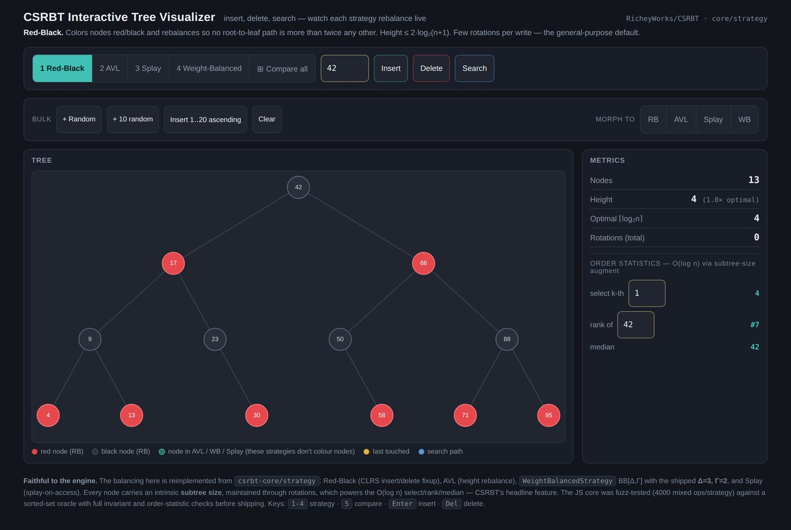
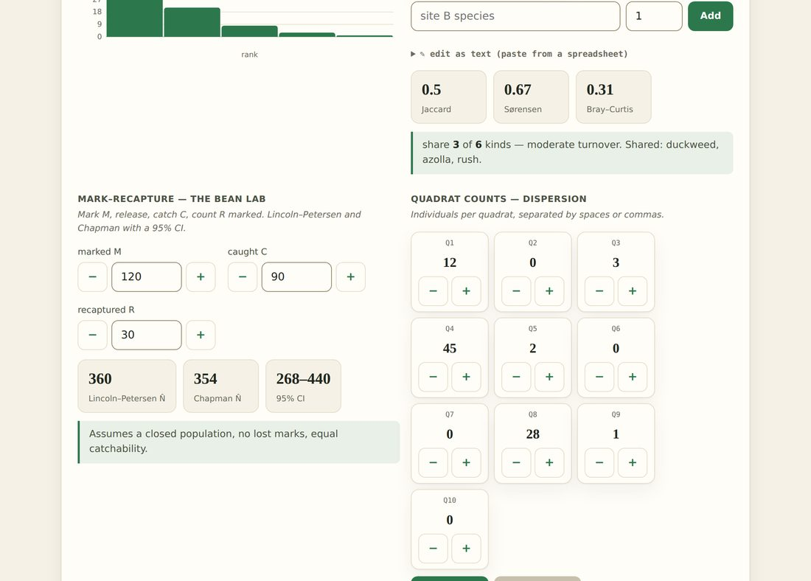
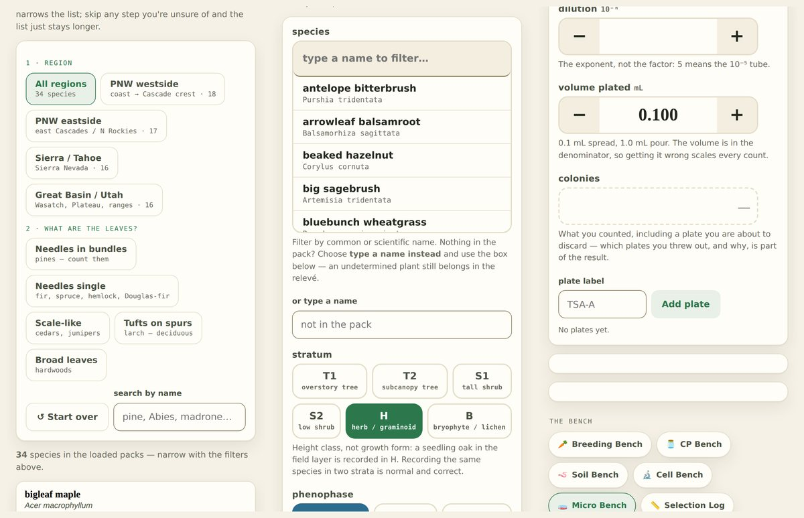

# CSRBT — Composable Self-Balancing Tree Engine

[](https://github.com/RicheyWorks/CSRBT/actions/workflows/ci.yml)
[](LICENSE)
[](https://openjdk.org/projects/jdk/17/)
[](https://gradle.org/)


> **New here — or not a coder?** Start with the [plain-English guide to the whole ecosystem →](https://github.com/RicheyWorks/WholeHog/blob/main/ECOSYSTEM.md): what all of this is, what you'd actually use it for, and how to get it running even if you've never written a line of code.


---

<p align="center">
  
</p>

<h3 align="center">A balanced tree that changes its own mind &mdash; and a field-science kit built on top of it</h3>

<p align="center">
  <b><a href="https://claude.ai/code/artifact/f6f89582-5c02-4961-ba18-30f97953995d">Open the visualizer</a></b> &nbsp;&middot;&nbsp;
  <b><a href="https://claude.ai/code/artifact/9976d26f-d4ac-42e4-86f4-6e05ec0dde4a">Open the science kit</a></b> &nbsp;&middot;&nbsp;
  <b><a href="https://claude.ai/code/artifact/d85bd722-b32f-4d3e-a9c6-229732d6af72">Read the honesty gate</a></b>
</p>

<p align="center"><sub>Type a key, hit insert, watch the rotations. Four strategies, the same operations,
side by side. No install, no build, no network.</sub></p>

---

## Two things, one engine

**The engine** is a Java ordered set whose balancing strategy is a plug &mdash; Red-Black, AVL,
Splay, Weight-Balanced &mdash; and which can *morph between them at runtime* when the workload
changes, validating the new tree through a health gate before it swaps. Every node carries a
subtree size, so rank, select, median and percentile are O(log n).

**The science kit** is what happens when you point that at biology. Thirty-three self-contained
HTML pages &mdash; twenty-two field instruments and eleven reference cards &mdash; that record real
data on a phone in a wet meadow with no signal, compute the standard indices, and print clean for a
lab report. One file per page. No install. No build step. No network.

<table>
<tr>
<td width="50%"><a href="https://claude.ai/code/artifact/9976d26f-d4ac-42e4-86f4-6e05ec0dde4a"></a></td>
<td width="50%"><a href="https://claude.ai/code/artifact/b2f9061c-d964-49b5-af31-3dbb33e2d4eb"></a></td>
</tr>
<tr>
<td><b>The kit hub</b> &mdash; twenty-two instruments, organised by what you are doing rather than by what it is called.</td>
<td><b>The workbench</b> &mdash; bring your own counts. Every number comes back with what it is worth.</td>
</tr>
</table>

<p align="center">
  
</p>

<p align="center"><sub><b>Built for a thumb, not a mouse.</b> Every control is at least 44&nbsp;px, sized from
a single token. Blank means blank &mdash; a field you did not record and a recorded zero are different
answers and never collapse into each other.</sub></p>

## What makes it different

Most teaching tools give you a number. This one tells you what the number is worth, and refuses
to give you numbers it cannot stand behind.

That refusal is written down as a rule &mdash; **[ADR-031](https://claude.ai/code/artifact/d85bd722-b32f-4d3e-a9c6-229732d6af72)**, a three-way gate every
figure in the kit must pass:

| | The gate | Example |
|---|---|---|
| **1** | Ship it, with a citation or a definition | Compost at 55&nbsp;°C for 3 days &mdash; *40 CFR 503 App. B*, cited on the page |
| **2** | Ship it, labelled a convention | The 10% trophic transfer figure &mdash; Lindeman's own paper reported 0.1% to 37.5% |
| **3** | **Refuse to ship it** | *&ldquo;Sarracenia need 3 months below 10&nbsp;°C&rdquo;* &mdash; the literature does not support a single number, so the app asks for yours and records where it came from |

Four instruments refuse outright: coefficients of conservatism in the Relev&eacute;, edibility in the
fungal pair, clinical breakpoints in Micro Bench, and nutrient-free verification in Soil Bench.
A kit that will not tell you whether a mushroom is safe to eat is more useful than one that will.

<table>
<tr>
<td width="50%"><a href="https://claude.ai/code/artifact/47a6369e-53b6-4a5e-acb9-b707af3f699c"></a></td>
<td width="50%"><a href="https://claude.ai/code/artifact/83012ca5-e604-4057-8b0d-07d347eb2d8e"></a></td>
</tr>
<tr>
<td><b>Reference cards, drawn.</b> Trap mechanisms, spore prints, keying vocabulary &mdash; as diagrams, not photographs, so they print and they work offline.</td>
<td><b>Food webs you build by tapping.</b> Connectance, chain length, and what a drawn web can and cannot tell you.</td>
</tr>
</table>

## Verified, not asserted

Nothing above is a claim about care. The kit measures itself, and the measurements run in one
command:

```
python3 tools/verify/run_all.py     →  33 of 33 jobs green
                                       1701 of 1701 checks passing
```

Eight kit-wide audits measure what the browser actually renders, not what the source intends:

| Audit | What it asks | What it found |
|---|---|---|
| `audit_targets.py` | Is anything interactive under 44&nbsp;px at phone width? | 143 controls were. Now 0. |
| `audit_contrast.py` | Does every painted colour pair clear WCAG&nbsp;AA? | 1,397 failures, from 4 tokens. Now 0. |
| `audit_focus.py` | Keyboard reach, visible focus, accessible names | 7 controls announced as nothing but their type. Now 0. |
| `audit_print.py` | Does the printed page still contain the document? | The visualizer printed at **104% ink coverage**. Now 0.1%. |
| `audit_offline.py` | Does it work with no signal &mdash; and on *one bar*? | A hanging font request held every page blank for 30+ seconds. Now paints in 180&nbsp;ms. |
| `audit_escaping.py` | Does anything you type come back as markup? | A plant named `Sarracenia <hybrid>` did. Now it does not. |
| `audit_frontend.py` | Duplicate ids, dead links, iOS zoom, JS errors | 0 high-severity findings |
| `audit_claims.py` | Which numbers in prose carry no visible provenance? | A worklist, not a gate &mdash; it never fails a build |

Every one of those audits was checked against a page with faults deliberately seeded in it before
its clean result was believed. A tool that has never been shown to fail is not evidence.

---


## The engine, in detail
CSRBT is a Java ordered-set engine whose balancing strategy is pluggable and can
adapt to the workload hitting it. A single, generic ordered-set API
(`OrderedSet<K>`, over any `Comparable` key or a custom `Comparator`) is backed by
interchangeable strategies — Red-Black, AVL, Splay, and a Hybrid — and the engine
can morph between them at runtime. A morph builds the new tree off to the side,
validates it through a health gate (contents, size, the strategy's own structural
invariant, and order-statistics spot-checks), and only then swaps it in — a failed
validation keeps the incumbent untouched, so there is never data loss. On top of
the ordered set it provides O(log n) order statistics (rank, select, median,
percentile, range) over a subtree-size augmentation.

The current release is a correct, well-tested core — the four strategies, order
statistics, persistence, undo/redo, and health-gated morphing — driven by a live
control plane that *decides* morphs automatically from the workload rather than on
explicit request (ADR-002 step 6). On top of that, the **multi-tree ensemble**
(ADR-003) keeps several members live over the same key set so adaptation becomes an
O(1) primary swap instead of an O(n) morph, with instant failover, quorum-verified
reads (with a tunable verification stride and lock-free unanimous votes, ADR-006/007),
two write-lean shadow modes, and memory ceilings. Members are no longer only
strategy-backed trees: the **engine family** adds a weight-balanced path-copying
persistent engine with wait-free readers and O(1) snapshots (ADR-005) and a
page-structured **B+tree** for large n (ADR-008), both first-class ensemble citizens
through the `RankedSet` seam. A `NavigableSet` adapter (ADR-009) makes the whole thing
a drop-in for `TreeSet` call sites. Adaptation decisions are observable end to end:
structured events, JSON tree export, and a session recorder feed a zero-dependency
visualizer (`demo/visualizer.html`) that **replays the controller's own decisions** —
load `docs/arena-session.json` and watch it morph RB → Hybrid → Splay → Hybrid on a live workload,
or `docs/arena-search-session.json` and watch the evolution machine itself: genomes
born, gate-killed, culled, and one promoted.
**ADR-011, the evolution machine, is complete**: the strategy family gained its first
*parameterized* member (`WeightBalancedStrategy(Δ, Γ)`, validated against its own
parameters by the health gate), a UCB1 bandit and a (μ+λ) population search breed and
trial policies as live ensemble shadows — births, deaths, and promotions all replayable
in the arena — and the story ends in a falsifiable experiment, answered honestly:
**searched parameters do not beat the four fixed strategies** (≥10% on no family across
3 seeds, deterministic comparisons/op). The search converged to the literature's WB(3,·),
unsound points like (5,3) self-disqualified on the record, and the adaptive claim stays
where it belongs — with the controller that picks the right specialist per workload.
**ADR-012, the ecology turn, is also complete** — the non-stationary axis, asked and
answered with instruments before mechanisms (viability map, diversity collapse,
regime-shift races, a pre-registered discriminating schedule, the real price of
switching) and closed with a disposition: the calibrated selector *ties* the best
fixed choice without hindsight, and chasing regime blocks is provably uneconomical at
realistic granularity. The same evolve-under-viability pattern then transferred to a
second policy space (cache eviction, `…csrbt.experimental.cache`), where the gate killed the
lethal genome on the record and evolution once again converged to the textbook answer.
The full story is in [the evolution machine section](#the-evolution-machine-the-story-told-honestly)
below.

The target architecture is specified in
[`docs/DESIGN-adaptive-engine.md`](docs/DESIGN-adaptive-engine.md); **ADR-001 through
ADR-012 are all Accepted** (ADR-011's verdict:
[`docs/CHANGELOG-2026-06-10-adr011-v5-experiment.md`](docs/CHANGELOG-2026-06-10-adr011-v5-experiment.md);
ADR-012's disposition:
[`docs/CHANGELOG-2026-06-11-adr012-disposition.md`](docs/CHANGELOG-2026-06-11-adr012-disposition.md)).
The suite is **1063 tests** (JUnit 5 + jqwik properties) with **zero javadoc warnings**,
green through `./gradlew build`, run by CI on JDK 17 and 21 (ADR-013) — including the
2026-08-12 hardening day's and 2026-08-17 sixth/seventh passes' probe tests, every one
shown failing before its fix counted.

## Architecture

The design is organized in three layers, with each layer depending only on the
one below it through a narrow interface.

**Mechanics.** `RedBlackTree<K>` is a thin engine over a sentinel-`NIL` node
model (`TreeNode1<K>`, which carries color, height, and a pluggable augmentor). It
is generic over the key type, with all ordering routed through a pluggable
`Comparator` seam (`withNaturalOrder` is the convenience factory for `Comparable`
keys). Balancing behavior lives behind the `TreeStrategy<K>` interface, implemented by
`RedBlackStrategy`, `AVLStrategy`, `SplayStrategy`, `HybridStrategy` (AVL
rebalance plus an RB recolor pass), and `WeightBalancedStrategy(Δ, Γ)` — the first
*parameterized* strategy (ADR-011): BB[α] weight balance over the intrinsic subtree-size
augment, its (Δ, Γ) dials forming the genome dimension the evolution machine searches,
with a strategy-supplied invariant hook so the health gate validates each candidate
against its own parameters. Strategies no longer depend on the concrete
engine: they operate against `MutableTree<K>`, a minimal structural interface
exposing `getRoot` / `setRoot` / `getNIL` / `rotateLeft` / `rotateRight` — the
only capabilities any balancing algorithm needs. `RedBlackTree<K> implements
MutableTree<K>`, so the engine and its strategies are decoupled without breaking
existing call sites.

**Orchestration.** `OrderedSet<K>` is the generic, client-facing facade: over
any key type it owns dedup-guarded add/remove, the size counter, order statistics,
the health-gated strategy morph, sliding-window eviction, pluggable augmentation,
and a self-repair rebuild. `TreeContext` is the `int` adapter over
`OrderedSet<Integer>`: it preserves the `int` public API and layers on the
genuinely `Integer`-bound machinery (undo/redo history, text-snapshot persistence,
cloning, and diagnostics/relic reporting) plus the utility delegates
`TreeDiagnostics`, `TreeCloner`, and `TreeHistory`. A morph never mutates the live tree in place — the candidate is
built aside, validated by `StrategyHealthCheck`, and swapped in only on a full
pass. Representation-neutral views are exposed through `OrderedCollection<K>` (add /
remove / contains / inOrder / size / clear) and `TreeEngine<K>`, so callers can
treat any backing structure uniformly.

**Evolution (legacy decision path).** `TreeGenome` is a self-interpreting fitness model
that scores how well each structure fits a workload and recommends morphs, and
`GenomeDrivenTreeController` ran it as a per-strategy feedback loop gated by an anti-thrash
`MorphPolicy`. As of ADR-002 step 6 that genome path is deprecated — the controller now
decides through the control plane (below) by default, keeping the genome loop only as a
flagged fallback. `StrategyBattleRunner` benchmarks strategies head-to-head across workload
types. The biological-model analytics (`TreeEcology`) live in a separate `…csrbt.experimental`
package that depends on core, keeping the core contract-bound (the alien-seed/swarm
theatrics that once lived there, `TreeAgent`, were removed in the 2026-07-14 capability
audit — zero tests, zero consumers). `TreeEngineRegistry` keeps
`TreeGenome.StructureType` honest — every declared type either maps to a working
engine or fails loudly as unsupported, rather than silently returning a no-op.

**Control plane (ADR-002 step 6).** The genome's successor is a pipeline of four small,
independently testable units in `io.github.richeyworks.csrbt.control`, each a pure function over an immutable
input so every adaptation decision is explainable from a single log line.
`WorkloadMonitor` folds the op stream into an immutable `WorkloadFeatures` vector —
read/write mix, hot-key access skew, mean search depth, rotation rate, size, and growth —
in O(1) per op with no tree traversal. `StrategyScorer` (the `CostModelStrategyScorer`)
rebases the per-structure weighting onto that vector and emits a ranked, cost-annotated
list of `StrategyId`s. `MorphPolicy` applies the cooldown / stability / minimum-improvement
gates over a `MorphHistory`. The `MorphController` runs them on a cadence and drives the
existing health-gated `setStrategy` through a `StrategyMorphTarget` seam, emitting one
`event=morph_eval` line per evaluation. As of Phase D, `GenomeDrivenTreeController` decides
through this pipeline **by default** (`useControlPlane`, default ON): reads as well as writes
drive the eval cadence, and the genome's self-interpreting fitness path is `@Deprecated` but
retained behind the flag for one-switch rollback.

**Ensemble (ADR-003).** `EnsembleOrderedSet<K>` is a drop-in `OrderedCollection` backed by
several strategy members kept in exact sync: every effective write fans out to all ACTIVE
members (sequentially by default, or in parallel across a daemon pool via
`parallelFanOut()` — always under one writer lock, so the logical set stays linearizable),
while reads are served by a `volatile` *primary*. Because every member is already warm,
adaptation is `promote` — an O(1) pointer swap — instead of an O(n) morph;
`EnsembleController` generalizes `MorphController` to drive promotions from the same
control plane, gated by the same `MorphPolicy`. Members carry a health lifecycle
(ACTIVE / QUARANTINED / RETIRED): a member that fails its cadence check or throws
mid-write is quarantined and healed from the primary, and a failing *primary* fails over
instantly to a healthy member. `VERIFIED` mode fans reads to a quorum and serves the
majority, quarantining dissenters (N-version programming against silent corruption) —
its cost is tunable on two axes: `verifyEvery(n)` votes on a deterministic stride of
reads instead of all of them (ADR-006), and a lock-free unanimous fast path serves
agreeing votes with no lock at all, escalating any dissent to the locked vote where
quarantine decisions stay race-free (ADR-007). `SAMPLED_SHADOW` is the memory-lean mode —
shadows receive only a sampled stride of writes (~1 + p·(K−1) cost) and pay an O(n)
sync-on-promote if elevated; `REBUILD_SHADOW` (ADR-003 Option C) is the write-lean one —
shadows take no live writes and are rebuilt wholesale from the primary on a cadence.
A soft memory ceiling (`memoryCeilingBytes`, observed and logged, never self-degrading)
and a hard cap on K (`maxMembers`) round out the memory controls. Snapshots persist the
primary only and rebuild members on load.

**Engine family (ADR-005, ADR-008).** Ensemble members need not be strategy-backed
trees: the `RankedSet` seam admits any engine honoring `OrderedSet`'s exact semantics
(the voting-parity contract), via `Builder.engineMember(...)` or the
`persistentMember()` shorthand. Two engines ship. `PersistentTreeEngine` is a generic
weight-balanced (Δ=3, Γ=2) path-copying structure: every read — including order
statistics — is a `volatile` root read plus a walk of immutable nodes, so readers are
**wait-free by construction**, and `snapshot()` is an O(1) immutable capture that stays
queryable forever; snapshots persist through `KeySerializer` as flat ascending keys.
`BPlusTreeEngine` is the large-n answer: keys live in fanout-sized leaf pages chained
for range scans, internal nodes are pure routing with per-child counts funding the full
order-statistics surface, and the in-memory layout is deliberately the on-disk page
layout for the held disk-backing slice. Engine members serve, vote, heal, and fail
over like any member; the cost-model scorer cannot rank them, so they are promoted
explicitly or by failover, never automatically.

## Quick start

```java
// Pick a balancing strategy; the facade is the only class clients touch.
TreeContext tree = new TreeContext(new RedBlackStrategy<>());

tree.add(42);
tree.add(17);
tree.add(99);

tree.contains(17);     // true
tree.size();           // 3
tree.inOrder();        // [17, 42, 99]

// O(log n) order statistics over the augmented tree.
OrderStatisticsOps<Integer> os = new OrderStatisticsOps<>(tree.getTree());
os.select(2).getData();      // 42  (2nd smallest)
os.rank(99);                 // 3
os.median().getData();       // 42

// Undo / redo (inverse-command history) and named checkpoints.
tree.getHistory().saveCheckpoint("baseline");
tree.remove(42);
tree.getHistory().undo();    // 42 is back

// Durable text snapshots.
new FilePersistenceAdapter().saveSnapshot("mytree", tree);

// The generic facade offers the same operations over any key type.
OrderedSet<String> words = OrderedSet.withNaturalOrder(new AVLStrategy<>());
words.add("pear"); words.add("apple"); words.add("fig");
words.inOrder();                            // [apple, fig, pear]
words.select(2);                            // "fig"  (2nd smallest)
words.setStrategy(new SplayStrategy<>());   // health-gated morph, contents preserved

// Snapshots work over any key type via a pluggable KeySerializer<K>.
FilePersistenceAdapter store = new FilePersistenceAdapter();
store.saveSnapshot("words", words, KeySerializer.string());
OrderedSet<String> restored = store.loadOrderedSet("words", KeySerializer.string());

// The ensemble (ADR-003): several members live at once; adaptation is an O(1) swap.
EnsembleOrderedSet<Integer> ens = EnsembleOrderedSet.<Integer>builder(Comparator.naturalOrder())
        .member(RedBlackStrategy::new)      // member 0 — initial primary
        .member(AVLStrategy::new)           // warm standby / promotion candidate
        .parallelFanOut()                   // E5: writes fan to members in parallel
        .build();
ens.add(42); ens.add(17);                   // fans out to all ACTIVE members
ens.contains(17);                           // served by the primary
ens.promote(ens.members().get(1));          // O(1): the warm AVL member now serves

// Ensemble snapshots persist the primary (the logical set) and rebuild members on load.
store.saveSnapshot("ens", ens, KeySerializer.INTEGER);
store.loadEnsemble("ens", KeySerializer.INTEGER, ens);

// Engine-tier members (ADR-005/008): wait-free persistent reads, page-structured large-n.
EnsembleOrderedSet<Integer> mixed = EnsembleOrderedSet.<Integer>builder(Comparator.naturalOrder())
        .member(RedBlackStrategy::new)
        .persistentMember()                                   // wait-free reads when promoted
        .engineMember(BPlusTreeEngine::withNaturalOrder, "BPlusTreeEngine")
        .mode(EnsembleMode.VERIFIED).verifyEvery(16)          // quorum reads, 1-in-16 vote stride
        .build();

// Wait-free O(1) snapshots on the persistent engine: "the set as of now" is a handle.
PersistentTreeEngine<Integer> eng = PersistentTreeEngine.withNaturalOrder();
eng.add(1); eng.add(2);
PersistentTreeEngine.Snapshot<Integer> frozen = eng.snapshot();
eng.add(3);
frozen.size();                              // 2 — immutable, queryable forever

// Drop-in NavigableSet over any OrderedSet (ADR-009): floor/ceiling/views, TreeSet parity.
NavigableSet<String> navigable = new NavigableOrderedSet<>(words);
navigable.floor("grape");                   // "fig"
navigable.subSet("apple", true, "pear", false);   // live, read-only range view
```

## Features

- **Generic keys** — `OrderedSet<K>` orders any key type through a pluggable
  `Comparator` (or `withNaturalOrder` for `Comparable` keys); the `int`
  `TreeContext` is a thin adapter over `OrderedSet<Integer>`.
- **Pluggable balancing** — Red-Black, AVL, Splay, and a Hybrid strategy behind
  one interface, swappable at runtime without data loss.
- **Order statistics** — `select`, `rank`, `median`, `percentile`, range count
  and range query in O(log n) via subtree-size augmentation, kept exact across
  inserts, deletes, rotations, and strategy morphs; `size()` is O(1) off the same
  augment (ADR-009 P1).
- **`NavigableSet` adapter** — `NavigableOrderedSet<K>` is a drop-in for `TreeSet`
  call sites: floor/ceiling/higher/lower are native single-descent primitives on
  `OrderedSet` itself, each answered in ONE guarded acquisition (ADR-021 — atomic
  under the concurrent-read model, where the old count-then-select composition could
  answer wrong under a racing writer); range and descending views are live and
  compose, and view mutators refuse loudly rather than rot quietly (ADR-009 P2).
- **Interval queries** — overlap and stabbing queries via a pluggable interval
  augmentor; tags survive morphs and snapshots.
- **Sliding-window / bounded set** — optional capacity (`setMaxSize`) that evicts
  the oldest-inserted key first, with order statistics kept exact on the
  survivors (streaming-percentile use case).
- **Undo / redo + checkpoints** — O(1)-per-op inverse-command history with named
  save points; a window-evicting add records its victim, so undo restores the
  evicted key too (2026-08-12 consolidation).
- **Persistence** — human-readable text snapshots (no Java serialization) over any key
  type through a pluggable `KeySerializer<K>` (`OrderedSet<K>` snapshots via
  `saveSnapshot`/`loadOrderedSet`; the `int` `TreeContext` path is the built-in
  `KeySerializer.INTEGER`, byte-identical to the legacy format). Hardened
  2026-08-12: saves are atomic (temp file + rename — a failed save leaves the
  previous snapshot intact), a truncated file is refused by the header size rather
  than loaded as a smaller tree, and string keys with control characters round-trip.
- **Diagnostics & evolution** — red-black validity checks, self-repair, workload
  scoring, and head-to-head strategy benchmarking (realized-depth scoring, warmed
  median-of-3 timing, and searches through each strategy's own path so Splay
  actually splays — ADR-022).
- **Adaptive control plane** — an O(1)-per-op workload monitor, a transparent cost-model
  strategy scorer, an anti-thrash morph policy, and the `MorphController` that runs them on
  a cadence and drives the health-gated `setStrategy`. As of ADR-002 step 6 Phase D this is
  the controller's **default** decision path; the genome loop is deprecated behind a flag.
- **Multi-tree ensemble (ADR-003)** — `EnsembleOrderedSet<K>` keeps K members in
  exact sync (parallel write fan-out under one writer lock) so adaptation is an **O(1)
  promote** instead of an O(n) morph, with instant failover, quarantine/heal/retire
  lifecycle, quorum-verified reads (`VERIFIED`), a memory-lean sampled mode
  (`SAMPLED_SHADOW`), a write-lean rebuild mode (`REBUILD_SHADOW`), memory ceiling and
  cap-K controls, and primary-only snapshots that rebuild every member on load.
- **Tunable verified reads (ADR-006/007)** — `verifyEvery(n)` makes VERIFIED's K× read
  amplification a dial (deterministic stride, default 1 = every read votes), and the
  optimistic unanimous fast path makes healthy votes **lock-free** (any dissent
  escalates to the locked vote, so quarantine stays race-free; sandbox rows: 15× at
  n=16, 2.7× under a saturating writer).
- **Engine family (ADR-005/008)** — beyond the strategy trees: `PersistentTreeEngine`
  (weight-balanced path-copying; wait-free readers, O(1) immutable snapshots,
  `KeySerializer` persistence) and `BPlusTreeEngine` (page-structured, leaf-chained,
  count-funded order statistics; the disk-ready layout). Both join ensembles as
  first-class members through the `RankedSet` seam (`engineMember(...)`).

## Project layout

Every source file's package matches its directory, so the tree below is also the
package layout.

```
src/main/java/core/
  ├─ MutableTree.java          structural seam the strategies depend on
  ├─ RedBlackTree.java         the generic engine (implements TreeEngine, MutableTree)
  ├─ TreeNode1.java            node model (color, height, subtree-size augment)
  ├─ OrderedSet.java           generic ordered-set facade (OrderedSet<K>)
  ├─ TreeContext.java          int adapter over OrderedSet<Integer>
  ├─ TreeEngineRegistry.java   structure-type → engine registry
  ├─ PersistentTreeEngine.java weight-balanced path-copying engine (ADR-005):
  │                            wait-free readers, O(1) immutable snapshots
  ├─ PersistentRankedSet.java  RankedSet adapter — the persistent engine as an
  │                            ensemble member
  ├─ BPlusTreeEngine.java      page-structured large-n engine (ADR-008): leaf
  │                            chain, count-funded order statistics
  ├─ adapter/                  NavigableOrderedSet — java.util.NavigableSet face
  │                            (ADR-009): TreeSet-parity navigation, live
  │                            read-only views
  ├─ strategy/                 TreeStrategy + RedBlack, AVL, Splay, Hybrid
  ├─ evolution/                TreeGenome, GenomeDrivenTreeController, StrategyBattleRunner
  ├─ control/                  adaptive control plane (ADR-002 step 6): WorkloadMonitor,
  │                            StrategyScorer, StrategyId, MorphPolicy, MorphHistory,
  │                            MorphController, StrategyMorphTarget
  ├─ ensemble/                 multi-tree ensemble (ADR-003): EnsembleOrderedSet,
  │                            EnsembleMember, EnsembleMode, EnsembleController,
  │                            MemberExecutor (sequential / parallel fan-out)
  ├─ augment/                  IntervalAugmentor
  ├─ interfaces/               TreeEngine, OrderedCollection, RankedSet (the
  │                            engine-member voting-parity seam), AugmentedTree, …
  ├─ persistence/              FilePersistenceAdapter (text snapshots)
  └─ util/                     diagnostics, cloner, history, order statistics,
                               strategy health check
csrbt-experimental/.../cache/  the second policy space (ADR-012 E6): CacheGenome,
                               SegmentedLruCache (viability oracle), CacheEvolutionLoop
csrbt-experimental/            opt-in instruments (TreeEcology analytics, ViabilityMap,
                               arena recorders) — depends on core, never
                               the reverse; core stays contract-bound
csrbt-core/src/test/           JUnit 5 + jqwik suite (strategy invariants, regressions,
                               property tests with shrinking)
csrbt-benchmarks/              JMH rig (ADR-013): the four fixed strategies under
                               shuffled insert / uniform lookup, JSON results
docs/                          design, audits, ADRs, changelogs, code reviews
demo/visualizer.html           single-file animated tree visualizer over the
                               TreeExport contract — open in any browser; loads any
                               exported JSON, animates between states (morphs!)
settings.gradle.kts            Gradle multi-module build (ADR-013)
.github/workflows/ci.yml       CI: gradle build on a JDK 17/21 matrix (ADR-013)
```

Paths above are rooted in `csrbt-core/src/main/java/io/github/richeyworks/csrbt/` — the module split (ADR-013)
encodes the dependency direction: `experimental → core`, `benchmarks → both`.

## Building and testing

The build is **Gradle 9.5** (ADR-013) with a **JDK 17 toolchain** — Gradle fetches
a matching JDK if your default differs. Dependencies resolve from Maven Central;
nothing is vendored.

**Never set up a project like this before?** You don't need to know Java or Gradle. Open [Claude](https://claude.ai) or ChatGPT and paste:

> *“Walk me through installing Java 17 and running `RicheyWorks/CSRBT` from GitHub, one step at a time. I'm on Windows (or Mac) and I've never done this — keep it simple.”*

It will take you the rest of the way. The full newcomer guide lives in [ECOSYSTEM.md](https://github.com/RicheyWorks/WholeHog/blob/main/ECOSYSTEM.md).


```
./gradlew build                      # compile everything, run the full suite
./gradlew :csrbt-core:test           # just the library suite
./gradlew :csrbt-core:jacocoTestReport   # coverage (build/reports/jacoco)
./gradlew :csrbt-core:javadoc        # API docs
./gradlew :csrbt-benchmarks:jmh      # JMH benchmarks (JSON in build/reports/jmh)
```

`build` fails if any test fails; per-module reports land in
`<module>/build/reports/tests/test`. The suite includes:

- `StrategyInvariantTest` — per-strategy invariants (RB validity, strict AVL
  balance, splay-to-root, Hybrid balance) checked against a `TreeSet` oracle,
  driven directly through the engine to isolate each strategy.
- `OrderedSetTest` — the generic `OrderedSet<K>` facade over non-`Integer` keys
  (`String` and a reverse `Comparator`), cross-checked against a `TreeSet` oracle.
- `RegressionFixesTest` — the earlier correctness/performance fixes (RB deletion,
  AVL balance, order-statistics integrity, undo/redo, snapshot loading).
- `AuditFixesTest` / `TagPreservationTest` / `CloneAugmentorTest` — duplicate-insert
  and history integrity, interval augmentation, and tag/augmentor preservation
  across morph, snapshot, and clone.
- `HealthGatedMorphTest` / `MorphPolicyTest` — morph validation + rollback and the
  anti-thrash cooldown/stability/margin gates.
- `WorkloadMonitorTest` / `StrategyScorerTest` / `MorphPolicyControlTest` — the
  `…csrbt.control` units: O(1) workload-feature extraction, the cost-model strategy
  ranking (the DESIGN §10 trace and each workload regime), and the promoted morph
  policy + `MorphHistory` (with `shouldMorph` parity to the legacy gate).
- `MorphControllerTest` / `StrategyIdBridgeTest` / `ControllerMonitorFeedTest` /
  `ControllerControlPlaneFlagTest` / `ControllerConvergenceTest` — the control-plane wiring
  (Phase D): one `event=morph_eval` line per evaluation and health-fail-keeps-incumbent, the
  `StrategyId`↔`StructureType` bridge, the O(1)-per-op monitor feed, the flag-gated re-point,
  and convergence (skewed reads → Splay in ≤1 morph, steady → 0 morphs, regime-following).
- `WindowingTest` / `PersistentTreeEngineTest` / `PersistentEngineConcurrencyTest` —
  bounded-set eviction; the weight-balanced path-copying persistent engine (ADR-005:
  oracle parity with invariants checked, adversarial-input balance, explicit snapshots,
  count-funded order statistics); and its wait-free-readers-under-churn proof plus the
  printed persistent-vs-R1-vs-READ_REPLICA read-throughput reference.
- `ConcurrentReadStressTest` / `EnsembleReplicaTest` — ADR-004 (R1/R2): torn-read-free
  optimistic reads on every strategy under write churn, and READ_REPLICA's left-right
  epoch reads (oracle exactness, churn with mid-stream promotions, loud degradation,
  printed read-throughput reference).
- `EnsembleOrderedSetTest` / `EnsembleControllerTest` / `EnsembleHealthTest` /
  `EnsembleVerifiedTest` / `EnsembleFanOutTest` / `EnsembleShadowTest` /
  `EnsemblePersistenceTest` / `EnsembleBenchmarkTest` — the ADR-003 ensemble (E1–E6):
  mirror fan-out against a `TreeSet` oracle, controller-driven O(1) promotion,
  quarantine/heal/failover, quorum voting, parallel fan-out (oracle equivalence,
  write-failure quarantine, linearizability under concurrent writers), sampled shadows
  (stride fraction, sync-on-promote, no-serve/no-vote), primary-only snapshot round-trips,
  and the O(1)-swap-vs-O(n)-rebuild benchmark.
- `EnsembleEngineMemberTest` / `EnsembleRebuildShadowTest` — engine-tier membership
  (ADR-005 P3: mirror/serve/vote/heal through the `RankedSet` seam, no auto-promotion,
  persistent-snapshot round trips) and Option C (`REBUILD_SHADOW` cadence cycle,
  sync-on-promote, ceiling latch + cap-K).
- `EnsembleVerifiedSamplingTest` / `EnsembleVerifiedConcurrencyTest` — ADR-006/007:
  stride-deterministic detection (caught on exactly the nth read), the bounded
  divergent-primary window, no-false-quarantines under write churn (skew always
  escalates and adjudicates clean), and both printed benchmark rows.
- `BPlusTreeEngineTest` — ADR-008: oracle parity at the fanout floor with the invariant
  checker run throughout, degenerate inputs, OrderedSet-parity order statistics and
  edge semantics, and VERIFIED unanimity beside strategy members as the end-to-end
  parity proof.
- `SizeAugmentTest` / `NavigableOrderedSetTest` — ADR-009: O(1) `size()` parity per-op
  under churn/morph/undo, and `TreeSet`-parity navigation swept across every boundary
  class plus view composition and the read-only clause.

Run the full suite after any change to the engine or strategies. CI runs the same
`gradle build` on a JDK 17/21 matrix (`.github/workflows/ci.yml`).

## Concurrency

`OrderedSet` (and the `TreeContext` adapter over it) supports **one writer, many readers**
(ADR-004 R1). Mutators serialize on an internal lock and stamp their mutations on a
`StampedLock`; public reads are **torn-read-free** — `contains`/`inOrder` run optimistically
with a step-bounded walk and are discarded unless the stamp validates, order statistics hold
the shared read lock, and facade reads never splay (Splay's move-to-root adaptivity lives on
the write path). Navigation (`floor`/`ceiling`/`lower`/`higher`, `countUpTo`,
`countBetween`) is **atomic per call** — one descent under one guarded acquisition
(ADR-021), so a racing writer can never slip between the pieces of an answer. Reads are safe, not lock-free — a read overlapping a write may briefly take
the shared lock; when reads must be wait-free, reach for the ensemble's `READ_REPLICA` mode
(ADR-004 R2) or the persistent engine (ADR-005), both below. Accessors such as
`getTree()`/`getEngine()` still expose live internal structure that bypasses the guard — they
remain a single-threaded diagnostics seam — and the `RedBlackTree`/strategy layer is **not**
thread-safe on its own.

The ensemble facade extends the same model to member granularity: `EnsembleOrderedSet`
serializes all writers on one lock (concurrent callers are safe and linearizable),
parallelizes the *internal* fan-out across members — only one thread ever touches a
member's write path at a time — and publishes promotion/failover as a `volatile` primary
swap. Reads served by the primary inherit R1's torn-read-free guarantee, and
`EnsembleMode.READ_REPLICA` (ADR-004 R2) makes them **lock-free**: epoch readers
(enter / re-verify / exit on the serving member's counter) read a tree no writer shares,
while the writer updates the non-serving mirrors first, flips, drains the old side's
epoch, then updates it.

`PersistentTreeEngine` (ADR-005) gets the strongest guarantee with the least machinery:
**wait-free readers by construction**. Every read — membership, traversal, order
statistics, snapshots — is one `volatile` read of the root followed by a walk of immutable
(`final`-field) nodes that can never change; mutators serialize on an internal monitor,
path-copy O(log n) fresh nodes aside, and publish with a single `volatile` store. No
stamps, retries, step bounds, or epochs anywhere on the read path, ensemble or not.
`snapshot()` is an O(1) immutable capture that stays queryable forever. The price is paid
on the write side: O(log n) allocation per mutation (GC pressure scales with write rate).

Two later refinements close the remaining gaps. VERIFIED votes no longer serialize
against writes in the healthy case (ADR-007): because writes are serialized, a lock-free
pass that comes back *unanimous* is a consistent cut and is served with no lock; any
disagreement — real divergence or read skew — escalates to the locked vote, where skew is
impossible and quarantine/failover decisions stay race-free. Combined with ADR-006's vote
stride, a healthy VERIFIED steady state takes no locks at all. `BPlusTreeEngine` takes
the opposite, deliberately coarse stance: every public method is synchronized, because a
paged tree mutates in place with no read guard and ensemble votes read members lock-free
— correctness first, page latching only if a workload ever demands it.

**The memory-model edges, named explicitly (ADR-010 X3).** Every cross-thread guarantee
above reduces to four standard happens-before mechanisms. (1) *Monitor edges:* each facade's
mutators serialize on one lock (`OrderedSet.lock`, the ensemble's `writeLock`, the engines'
internal monitors), so writer→writer ordering is total and anything a writer did is visible
to the next writer. (2) *Volatile publication:* the persistent engine's root, the ensemble's
`primary`, member lifecycle fields (`state`, `exact`), `mode`, and the kill switches are
`volatile` — a reader that observes the new reference/state also observes everything written
before its store, which is why an atomic swap is a complete publication. (3) *Stamp
validation:* R1's optimistic reads are speculative — the `StampedLock` validate supplies the
read fence, and a failed validation discards everything observed in the window. (4)
*`final`-field semantics:* the persistent engine's all-`final` nodes are safely published by
construction; no reader can see a partially built node. The one deliberate non-edge: ADR-007's
lock-free vote pass reads with no fence at all and is correct anyway, because writes are
serialized (edge 1) — at most one is in flight, so a unanimous answer is identical whether
each member was read before or after it; any skew shows up as disagreement and is
re-adjudicated under the lock, never served.

## The evolution machine: the story, told honestly

ADR-011 asked a falsifiable question: *if the balancing policy itself becomes searchable —
a genome, bred and trialed live behind the health gate — does the search find something
the four textbook strategies miss?* The machine was built in five slices in one day, and
the arc is worth telling because every twist is on the record.

**The first run drew blood.** The moment `WeightBalancedStrategy(Δ, Γ)` existed and the
health gate learned to ask a strategy for *its own* structural invariant, the very first
parameter sweep found that WB(5,3) — comfortably inside the documented bounds — is
**unsound**: under live delete churn its one-rotation-per-level repair fails to restore
its own Δ-balance, and the gate disqualified it by the strategy's own testimony (contents
stayed oracle-exact — only balance degrades; the gate is why nothing was ever at risk). Nobody
went looking for that; it's pinned as a regression now
([V1](docs/CHANGELOG-2026-06-10-adr011-v1-weight-balanced.md)).

**The search machinery never got to cheat.** Genomes are bounds-checked vectors with
seeded, pure perturbation ([V2](docs/CHANGELOG-2026-06-10-adr011-v2-genome-fitness.md));
the UCB1 bandit and the (μ+λ) population controller trial candidates only as live
ensemble shadows, and promotion goes through the same anti-thrash morph gates as every
other adaptation decision ([V3](docs/CHANGELOG-2026-06-10-adr011-v3-policy-bandit.md),
[V4](docs/CHANGELOG-2026-06-10-adr011-v4-evolution.md)). V3 also surfaced a real seam
bug the design predicted: the old class-identity guard silently refused WB(3,2)→WB(4,2)
morphs — parameterized strategies forced `samePolicyAs` into the strategy contract.

**The experiment answered no — twice, which is once more than it had to.** The
acceptance run ([V5](docs/CHANGELOG-2026-06-10-adr011-v5-experiment.md)) raced the
evolved policy against RB/AVL/Splay/Hybrid on five workload families × three seeds. The
first wall-clock run said *yes, ≥10%*; the second run said *no* — so the experiment
caught its own metric being weather (time on shared hardware) and was rebuilt on
**comparisons per op counted at the comparator seam**: deterministic, byte-identical
across runs. On that honest metric the evolved policy beats three of the four fixed
strategies almost everywhere (~15% fewer comparisons than RB on uniform) — but every
family already has a specialist within 10%. The search converged to the literature's
WB(3,·) on every family and seed: the machine independently confirmed the textbook
default is locally optimal. **The adaptive claim stays with the controller that picks
the right specialist, not with a fifth structure.**

**You can watch all of it.** Drop
[`docs/arena-search-session.json`](docs/arena-search-session.json) into
[`demo/visualizer.html`](demo/visualizer.html): founders enter the nursery, the unsound
WB(5,3) dies by its own invariant in generation 1 (V1's finding, replayed live), a
too-strict mutant follows it, and WB(3,2) takes the throne through the morph gates off a
splay primary. Nothing in the file is staged — every frame is the real controller's own
decision on a seeded stream, snapshotted the moment it committed.

**Where it pointed next** was [ADR-012, the ecology turn](docs/ADR-012-ecology-turn-2026-06-10.md):
V5 closed the *stationary* axis but never tested adaptation under a *changing* workload.
E1–E3 ran the same day, instruments before mechanisms, and every honest answer landed
harder than its thesis. The [viability map](docs/viability-map.json) (drop it on the
visualizer): the viable (Δ, Γ) region is a **sliver** — 2 cells of 46, (3,2) and (4,2),
the literature's narrowness result reproduced by the gate built to catch it, which
retroactively explains V5's convergence ([E1](docs/CHANGELOG-2026-06-10-adr012-e1-viability-map.md)).
The collapse, measured: **the viability filter, not selection, collapses diversity** —
one lineage from generation 1, every seed; the mutation walk to the sliver takes 6–7
generations ([E2](docs/CHANGELOG-2026-06-10-adr012-e2-diversity.md)). And the
regime-shift experiment, with exploration priced at the comparator seam: **no adaptive
scheme of any architecture — evolution, elite, or the ADR-002 selector — beats the best
fixed strategy**; live evolution pays O(n) candidate rebuilds per generation while
serving costs log n, and the selector's per-morph bill still runs ~1.5× hindsight-best
AVL ([E3](docs/CHANGELOG-2026-06-10-adr012-e3-nonstationary.md)). Three instruments,
three negative results, all reproducible, all replayable — the machine keeps earning
its keep by saying no with receipts. E4–E6 stay staged in the ADR, each with a now
*measured* bar to clear.

**The day's last two slices turned the no into a diagnosis, then a fix.** E3b
pre-registered a discriminating schedule from V5's own winners table (oracle gap
~13.5%, premise hard-asserted) and caught the selector red-handed: **it never morphed
once through a 36% opportunity**, because its Phase-B cost model predicted the wrong
meter — it told the controller RB was 30% *better* where the comparator seam measured
AVL winning every diet probed
([E3b](docs/CHANGELOG-2026-06-10-adr012-e3b-discriminating-schedule.md)). The fix was
perception, nothing else: the scorer's constants refit to the realized
comparisons-per-op tables already on the record — shape kept, gates and schedules
untouched ([calibration](docs/CHANGELOG-2026-06-10-scorer-calibration.md)). The
calibrated selector goes from never morphing to **tying hindsight-best AVL within ~1%
on E3 and ~3.5% on E3b, while paying its own morph rebuilds** — the selector rows
above are superseded, but both verdicts remain no: the registered bar is a ≥10% *win*
over best fixed, and tying isn't winning. The claim, precisely sized: *the calibrated
selector matches the best fixed choice without knowing it in advance; it does not yet
beat it.* The residual ~13% oracle gap lives in the sequential blocks (the oracle
rides Splay at 13.7 cmp/op where AVL pays 20.3) — and the follow-up experiment
([E3c](docs/CHANGELOG-2026-06-11-adr012-e3c-switching-cost.md)) showed that gap is a
**free-switching fiction**: clairvoyant switchers handed the winners table outright,
paying real costs (O(n) morph rebuilds, or a MIRROR ensemble's O(1) promote with its
standing fan-out), lose **~50% to plain fixed AVL on every seed** — the cheapest real
way to switch costs more than three times the entire prize. The held recency-feature
upgrade is retired with receipts: perfect perception still loses, so better perception
cannot help. The selector's refusal to chase blocks was correct economics all along.

**The last staged slice asked whether any of this is about trees at all.** E6 pointed
the evolve-under-viability machinery at a second policy space — cache eviction, with a
two-gene segmented-LRU genome whose box deliberately contains a lethal point (no
probation: this space's WB(5,3)) — and published the split verdict
([E6](docs/CHANGELOG-2026-06-11-adr012-e6-transfer.md)): **the pattern and the seams
transfer; the loop class doesn't.** `MorphPolicy`, the `TreeEvent` vocabulary, and the
recorder seam crossed unchanged; the generation protocol had to be re-typed. The gate
killed the lethal genome on the record with zero unsafe promotions, and the motif held
in the new space exactly as it held in the old: on a drifting workload evolution
discovered that pure LRU beats the textbook segmented split (frequency-earned
protection is a liability when the hot set moves), converged to it, and tied the best
fixed choice at Δ+0.000 — matching, never beating. That closes ADR-012's last staged
item; the contribution is the pattern, measured twice.

## Feeding the engine (2026-07)

The July 2026 work opened CSRBT to external feeders — the reference feeder is
[SuperBeefSort](https://github.com/RicheyWorks/SuperBeefSort), whose sort engine profiles data, constructs sets in O(n)
born with the profile-advised strategy, and drives every adaptation tier live (see its
`docs/audit-csrbt-feeding-2026-07-07.md` for the full integration story). The seams it fed
back into the core:

**The workload signal seam.** `OrderedSet.searchDepth(K)` is the measuring twin of
`contains` — one never-splaying walk answers containment *and* the realized depth
(`depth ≥ 1` present, `~depth` absent) — and `OrderedSet.rotationCount()` meters structural
churn via a `MutableTree.onRotation()` hook under every strategy's rotations. Together they
give `WorkloadMonitor.recordSearch/recordAdd` real values for `meanSearchDepth` and
`rotationsPerWrite`, the two feature-vector components that previously had no public origin.
`EnsembleOrderedSet.searchDepth` extends this to ensembles with one hard rule: **depths never
vote** (members holding the same keys in different shapes legitimately disagree), so VERIFIED
voted reads vote containment exactly as `contains` would and report an honest unmeasured zero,
while MIRROR reads and VERIFIED's non-voted strides measure the primary's walk.
`EnsembleController.contains` records it, so ensemble scoring finally sees tree shape.

**Windowed ensembles.** `EnsembleOrderedSet.setMaxSize(n)` fans the sliding window across
members. Mirrors stay exact because all writes fan out under one writer lock in one order:
identical insert sequences build identical FIFOs and evict identical keys. Ensembles with
engine-tier members refuse the window (`supportsWindow()`) rather than silently diverging.

**Hardening (2026-07-08, `docs/hardening-audit-2026-07-08.md`).** Snapshot loads are now
health-gated (the morph gate applied to file input — corrupt or tampered `.rbt` files are
refused, not served); event listeners can no longer break the write path (`emit` isolates
listener faults); per-op key logging sits below INFO; `Builder.optimisticVotes(boolean)` pins
an instance's VERIFIED vote path against the process-global kill switch; and the deprecated
`TreeGenome` no longer implements `Serializable`.

Benchmarks: `SearchDepthBenchmark` prices the measuring read against `contains`
(`./gradlew :csrbt-benchmarks:jmh`). Changelogs:
[`CHANGELOG-2026-07-07-workload-signal-seam.md`](docs/CHANGELOG-2026-07-07-workload-signal-seam.md),
[`CHANGELOG-2026-07-08-ensemble-window-depth.md`](docs/CHANGELOG-2026-07-08-ensemble-window-depth.md).
And SuperBeefSort's `./gradlew run --args="organism"` records a live
profile → born-optimal → drift → morph-evaluation session to JSON that
[`demo/visualizer.html`](demo/visualizer.html) replays.
(The arena replay recorders themselves are Gradle tasks now:
`./gradlew :csrbt-experimental:arenaSession` and `:csrbt-experimental:searchArenaSession`.)

## The ecosystem (2026-07)

CSRBT is the index engine of a fourteen-engine organism, each engine its own repo, composed
by nested Gradle composite builds — clone them as siblings and every build resolves the live
sources. The founding six:

| Engine | Role |
|---|---|
| **CSRBT** (this repo) | the adaptive ordered index — orders the world |
| [SuperBeefSort](https://github.com/RicheyWorks/SuperBeefSort) | the intake tract — profiles, sorts, feeds in O(n) |
| [SmokeHouse](https://github.com/RicheyWorks/SmokeHouse) | the log-structured store — durability, tail, watchers, read replicas |
| [Carver](https://github.com/RicheyWorks/Carver) | the read planner — costs access paths with CSRBT order statistics as its histogram |
| [Renderer](https://github.com/RicheyWorks/Renderer) | the materialized-view engine — folds the store's tail into CSRBT-held ranked aggregates |
| [Brine](https://github.com/RicheyWorks/Brine) | the adaptive cache — eviction policy evolved by `csrbt-experimental`'s cache-evolution loop |

Engines 7–11 (2026-07-18): [PitBoss](https://github.com/RicheyWorks/PitBoss) (replica-fleet
conductor) · [DryAge](https://github.com/RicheyWorks/DryAge) (time travel over the immutable
log) · [Twine](https://github.com/RicheyWorks/Twine) (crash-atomic batches) ·
[SmokeSignal](https://github.com/RicheyWorks/SmokeSignal) (loopback wire protocol) ·
[Jerky](https://github.com/RicheyWorks/Jerky) (compressed cold archives).
Engine 12: [WholeHog](https://github.com/RicheyWorks/WholeHog) — the integration organism: all of them, composed and asserted together.
Engines 13–14 (2026-08-19): [Rub](https://github.com/RicheyWorks/Rub) (observability — the tail watcher promoted to an organ) · [Sizzle](https://github.com/RicheyWorks/Sizzle) (chaos — deterministic fault injection at the write seam).

Brine is `csrbt-experimental`'s first external consumer — the publication trigger ADR-013 §4
held for two months fired on 2026-07-18, and the module now publishes alongside `csrbt-core`
(`./gradlew publishToMavenLocal`). Engine selection history:
[`SuperBeefSort/docs/adr-fifth-engine-candidates.md`](https://github.com/RicheyWorks/SuperBeefSort/blob/main/docs/adr-fifth-engine-candidates.md).

## The ecology layer (2026-08)

The experimental module now carries a full community-ecology instrument suite over the
engine family — standard field-course models, applied where each engine's structure
genuinely carries them. Keys are species, access frequency is abundance, time is counted
in operations, and every index is oracle-tested and deterministic.

| Instrument | Model | Over |
|---|---|---|
| `EcologyRecorder` | abundance / demography / growth recording | any engine's op stream |
| `CommunityMetrics` | Shannon, Simpson, Hill numbers, rank-abundance fits, Chao1, rarefaction | any abundance distribution |
| `BetaDiversity` | Jaccard, Sørensen, Bray-Curtis, Renkonen, Pianka, Whittaker | windows, communities, generations |
| `LifeTable` / `LogisticGrowth` | Deevey survivorship, Verhulst growth | key lifespans, population series |
| `EnsembleCommunity` | Levins metapopulation | ensemble members as patches |
| `SnapshotLineage` | descent with modification | persistent-engine snapshots as strata |
| `RangeQuadrats` | quadrat dispersion (Morisita) | any engine's key space |
| `CacheIsland` | island biogeography | the cache at carrying capacity |

**Start here: [`docs/ecology.html`](https://claude.ai/code/artifact/9976d26f-d4ac-42e4-86f4-6e05ec0dde4a)** — the science-kit hub, a single front
door to everything below. Every page cross-links the others and prints clean for a lab report —
no install required.

**The reference shelf** — read, look up, cite:

- [**`docs/ecology-lab.html`**](https://claude.ai/code/artifact/b2f9061c-d964-49b5-af31-3dbb33e2d4eb) — the **Interactive Lab**: a live terrarium
  plus a browser Workbench that runs every instrument on your own field data, entered through
  tap-friendly chip editors and steppers (the pasted-text form is still there under "edit as text").  **Touch targets brought to the kit's own 44px floor.** The Lab was not migrated to the Field Entry Kit
  — measured at phone width its inputs were already 44px, and it is a desk-read interactive document rather
  than a gloved-thumb field app, so wrapping every parameter in a 60px control would have been consistency
  for its own sake. What the measurement *did* find was **76 buttons under 44px**: the +/− on tally chips,
  the quadrat steppers and the ✕ removers, all hardcoded at 34–38px. Those are the most-tapped controls on
  the page — a tally +/− gets pressed hundreds of times in a lab session — so it was exactly the wrong place
  to save eight pixels. They now come off a single `--fe-tap` token, the same discipline FEK applies on the
  tablet apps.

- [**`docs/ecology-teachers-guide.html`**](https://claude.ai/code/artifact/95c7a8d9-3c0b-4242-ab7e-0a9d6fc8ae55) — the **Teacher's
  Guide**: how to actually run a term on this — a twelve-week sequence, logistics for thirty students
  on six tablets, prep checklists, three assessment rubrics, what to do when it rains, and an honest
  list of what the kit can't do. Start here if you're teaching with it.
- [**`docs/ecology-lab-manual.html`**](https://claude.ai/code/artifact/0ec3b849-297f-49e6-8de1-e4e8607ad4fe) — the **Field & Lab Manual**:
  seven ready-to-run labs (behavior, genetics, biodiversity, mark–recapture, Hardy–Weinberg, island
  biogeography, food webs) with printable data sheets, procedures, and `.eco` pre-registration — each
  wired to the tablet app that collects its data.
- [**`docs/ecology-field-guide.html`**](https://claude.ai/code/artifact/fbced263-f1bc-49f5-88f7-d6998d8b85fa) — the **Field Guide**: the
  plain-language reference behind the instruments, station by station (also
  [`ECOLOGY-FIELD-GUIDE.md`](docs/ECOLOGY-FIELD-GUIDE.md) as Markdown).
- [**`docs/eco-protocol-reference.html`**](https://claude.ai/code/artifact/c54e14b5-2345-47f2-a7a6-5f701bd023ba) — the **`.eco` Reference**:
  every keyword of the plain-text experiment format, and the browser → file → grade → export
  round-trip (worked example in [`sample-experiment.eco`](docs/sample-experiment.eco)).
- [**`docs/ecology-glossary.html`**](https://claude.ai/code/artifact/f67d9ef5-dbbf-43ff-91c6-d24382d214df) — the **Glossary**: every term the
  kit uses, defined in a sentence and linked to the tool that computes it &mdash; 113 entries in twelve
  sections, including botany, mycology, animal behaviour, selection, and the cell and microbiology bench; and
  [**`docs/eco-protocol-library.html`**](https://claude.ai/code/artifact/d608dd5a-abe1-4178-b8f5-291911d05ce4) — five complete, copyable
  `.eco` experiments; and [**`docs/ecology-field-card.html`**](https://claude.ai/code/artifact/f70c3623-a7da-403b-adc3-be9e36f44642) — the
  **Field Card**: 78 metrics across sixteen blocks on one printable bench sheet, each with what it
  tells you, its interpretation band, and the tool that produces it &mdash; the Workbench measures,
  the forest-plot set (BA, QMD, Reineke SDI, importance value, clinometer height, van Wagner CWD,
  folded aspect), the vegetation set (cover classes, Shannon on cover, mean C, FQI, adjusted FQI,
  prevalence index, LPI with its binomial SE), the fungal set (S<sub>obs</sub> against Chao1,
  singletons and doubletons, productivity, guild spectrum), and the biology bench &mdash; time budgets and
  Cohen's &kappa;, selection differentials and gradients and h&sup2;, Poisson counting error, CFU/mL and the
  30&ndash;300 rule, &micro; from ln(OD). Every caveat that matters is printed next to the number rather than
  left in a manual.
- [**`docs/ecology-essay.html`**](https://claude.ai/code/artifact/c0140e29-c835-4759-af7b-5d5bb66c38d1) — **The ecology of a tree**: the essay
  behind the layer — the audit that found constants where instruments should be, and the ride to the
  128k-op amortization frontier (also [`ESSAY-the-ecology-of-a-tree.md`](docs/ESSAY-the-ecology-of-a-tree.md)).

**The field tools** — tablet-first apps and games where the data entry is taps, the display is
live, and every export carries site, observer, and date plus a CSV for Excel/R:

- [**`docs/releve.html`**](https://claude.ai/code/artifact/6a9c95fd-c144-470a-937a-9af08fda1e2d) — **Relev&eacute;**: the botanist's vegetation plot sheet —
  cover by stratum on Braun-Blanquet, Daubenmire or direct percent; Shannon and evenness computed on
  **cover** rather than counts; Floristic Quality Assessment (mean C, FQI, adjusted FQI) that refuses to
  invent coefficients of conservatism and takes them from your regional list instead; non-native load
  flagged by cover; **line-point intercept** with the transect planned before you walk it and cover
  reported with a binomial standard error; **wetland indicator status and the prevalence index**, weighted
  by cover, with the &le;3.0 threshold stated as one of three delineation criteria rather than a verdict;
  per-species phenophase; a functional-group spectrum by growth form; and voucher records that render as
  printable herbarium labels with locality, habitat and associates filled from the plot. 49 western
  understory taxa, and any flora can be loaded. **On the Field Entry Kit** (ADR-031 action 7): the cover
  dial is coloured by class *midpoint* rather than by position, so Braun-Blanquet 2 and Daubenmire 2 —
  both a 15% midpoint — read as the same colour and switching scale mid-survey cannot silently change what
  a colour means. Strata, moisture and the eight-point aspect are dials for the same reason: all ordinal.
  66/66 verified.
- [**`docs/ethogram.html`**](https://claude.ai/code/artifact/3674f5ad-e8dc-42ba-9b8a-0e6de6c199c7) — **Ethogram**: behavioural sampling built on
  Altmann's distinctions rather than a tally counter. You declare the **sampling rule** (ad libitum, focal,
  scan, behaviour) and the **recording rule** (continuous, instantaneous, one-zero) and the recorder changes
  shape to match &mdash; states run on a timer one at a time, events are tapped, point samples advance with a
  scan clock. It refuses incoherent designs out loud (scan sampling cannot be continuous) and it **will not
  convert one-zero scores into a time budget or a rate**, because they estimate neither. Time budgets are
  computed over *observed* time, which is why *out of sight* is a first-class state. Plus transition matrices
  with the first-order Markov assumption stated and thin rows flagged, event rates per observed minute,
  **Cohen's &kappa;** with a confusion matrix that names your commonest disagreement, and a pseudoreplication
  warning when everything came from one animal. Ethograms are validated, swappable JSON packs whose importer
  rejects definitions written in terms of motivation rather than posture. **On the Field Entry Kit**: the
  interval and session-length steppers ship filled in at 30 s and 10 min — the only pre-filled numeric
  fields across the four migrated pages, because a scan sample with no interval is not an under-specified
  design but no design at all. State versus event is a dial, since the choice decides what the data can
  answer. 71/71 verified.
- [**`docs/selection-log.html`**](https://claude.ai/code/artifact/4a9cc620-ddc8-498e-b976-69afad60de88) — **Selection Log**: evolution measured in the
  field, on marked individuals, the way a long-term study measures it. Repeated morphometrics give a
  **repeatability (ICC)** first, because random measurement error attenuates every gradient downstream by
  roughly that factor and no sample size fixes it &mdash; the page prints the corrected β beside the raw one
  and says to report both. Then the **differential S**, the **intensity i**, and the **gradient β** with the
  identity β&nbsp;=&nbsp;i shown explicitly as the proof that a univariate analysis has not separated direct
  from indirect selection. **Parent&ndash;offspring heritability** from mid-parent regression (doubled, and
  flagged, from a single parent), and **R&nbsp;=&nbsp;h&sup2;S** printed as a hypothesis the next generation
  will test rather than a forecast. Trait distributions before and after the episode, a fitness-on-trait
  scatter, and a per-individual CSV shaped for the multiple regression the page deliberately does not attempt.  **Migrated to the Field Entry Kit (v1.1.0).** Three of the choices are about the data rather than the
  ergonomics. **Survival is two taps reading *died* / *survived*, not a box you type 0 or 1 into** — a
  stray keystroke in a numeric box turns a death into a survival and nothing about the record looks wrong
  afterwards. **An unrecorded count is not a zero**: count steppers start empty, because zero recruits is a
  real observation and not-having-checked is not, and averaging the two together biases every estimate on
  the page downward; the first tap starts at 1, since 0 is a value you should have to choose. **A trait
  value is typed, not stepped** — a bill depth comes off calipers, and rounding at entry would inflate the
  repeatability that everything downstream is bounded by. The migration also surfaced a real defect: 
  changing the fitness component used to silently reinterpret values recorded under the previous one, so a
  1 meaning *survived* became one recruited offspring. It now keeps them, says so, and offers to clear.
  75/75 verified.

- [**`docs/breeding-bench.html`**](https://claude.ai/code/artifact/34e0aed2-dd77-4de6-9370-033ca179f20f) — **Breeding Bench**, the vegetable-breeding
  suite, third instrument on the Field Entry Kit. Six benches over one seed crop. **Population** applies the
  rule that seed be saved from at least **20 inbreeding or 100 outbreeding individuals**, per crop, from a
  28-crop table carrying mating system and pollination vector — and explains why the two halves fail
  differently: for an inbreeder twenty is about off-types, for an outbreeder a hundred is about the recessive
  load heterozygosity has been hiding. **Effective population size** Nₑ&nbsp;=&nbsp;4NₘNₑ/(Nₘ+Nₑ)
  with &Delta;F&nbsp;=&nbsp;1/(2Nₑ) per generation and its ten-generation accumulation, flagging when the
  rarer sex is what caps you. **Isolation** ships a distance only for the four crops where one is citable
  (NMSU H-262: two miles for corn, half a mile for three *Cucurbita*) and **refuses the rest outright** — the
  numbers in circulation are regionally assigned and revised, so the page takes yours and records provenance.
  It does ship the species traps, which are definitional and cost people whole crops: all cabbage, kale,
  broccoli, cauliflower, kohlrabi and Brussels sprouts are **one species**; carrot crosses with wild Queen
  Anne's lace; beet and chard are the same plant. **Selection** computes intensity
  *i*&nbsp;=&nbsp;&phi;(&Phi;&#8315;&sup1;(1&minus;p))/p from the proportion kept and prints
  R&nbsp;=&nbsp;*i*&nbsp;h&sup2;&nbsp;&sigma; as a hypothesis, with h&sup2; **labelled an assumption rather
  than a measurement** and the tension named in plain terms: the harder you select, the fewer parents you
  keep, and the faster you inbreed. A roguing log reads across to the population floor. **Trial** runs a
  randomised complete block analysis — LSD&nbsp;=&nbsp;t&#8320;&#46;&#8320;&#8322;&#8325;&nbsp;&radic;(2&nbsp;MSE/r)
  and CV% from the error mean square — and states the multiple-comparison trap on the same screen: LSD lies
  when you have many entries. **Seed** does germination with the binomial standard error
  &radic;(p(1&minus;p)/n), so a 90% germination on 100 seeds is reported as 90&nbsp;&plusmn;&nbsp;3%, and gives
  storage as a range labelled a convention. 85/85 verified.
- **The three suite front doors** — [`docs/cp-suite.html`](https://claude.ai/code/artifact/e5047243-2e14-499f-96db-de8d959f7341),
  [`docs/soil-suite.html`](https://claude.ai/code/artifact/f0a3616b-e583-403e-aefc-1d61291425c1) and
  [`docs/breeding-suite.html`](https://claude.ai/code/artifact/4ef21d3c-e800-47db-9637-cb913a18de0d). The kit is organised by *method*; a suite is
  organised by *what you grow*. Each front door opens on a **numbered path through the work in the order
  mistakes actually happen** — water before media for carnivorous plants, C:N before the pile for compost,
  population before selection for breeding — then lists every instrument the suite uses, including the ones
  it borrows from the wider kit, and closes with a **what this suite will and will not tell you** panel that
  sorts its own figures into shipped-with-a-source, shipped-as-a-labelled-convention, and refused. Each ends
  by naming the thing it cannot resolve for you: for carnivorous plants, that no citable dormancy schedule
  exists; for compost, that time-and-temperature is a *pathogen* criterion and not a maturity one, so a
  green chart must not be read as "finished"; for breeding, that selection intensity and effective
  population size pull against each other and no tool can settle the balance — so the bench shows both
  numbers at once, while you are choosing, rather than three generations later. 122/122 verified.
- [**`docs/cp-bench.html`**](https://claude.ai/code/artifact/7157a566-4ecf-4501-9433-fb006660ae29) — **CP Bench**, the carnivorous-plant suite, second
  instrument on the Field Entry Kit. **Water first**, because it kills more carnivorous plants than anything
  else: TDS logged per source against the published **&lt;160&nbsp;ppm** guidance (with the stricter ~50&nbsp;ppm
  hobby target labelled a convention), RO membrane creep flagged when output climbs, and the **tray
  accumulation arithmetic** &mdash; ten top-ups at 50&nbsp;ppm leaves as much dissolved solid in the pot as one
  watering at 500, which is how growers using genuinely good water still lose plants. Nutrient-free media by
  parts with the standard mixes offered as **hobby conventions rather than requirements** and coir flagged for
  its salts; a per-plant log with a provenance field, because several taxa are legally protected and the group
  is heavily poached; and a cross log through to germination with the pod-parent-first convention enforced.
  **The Dormancy tab ships no numbers**: research found no citable source for per-genus dormancy temperatures,
  durations or photoperiods, so the page takes your target, records it with the data, and tracks against it.
  The *fact* that a genus needs a dormancy is well established and does ship &mdash; the distinction is
  ADR-031's gate system doing its job.
- [**`docs/soil-bench.html`**](https://claude.ai/code/artifact/7ce205cb-286c-4d44-b054-2e7d39cfeaa4) — **Soil Bench**: compost, mixes and texture, and the
  first instrument built on the **Field Entry Kit** (see
  [`ADR-031`](docs/ADR-031-entry-layer-and-suites-2026-08-24.md)). The compost log tracks a pile against the
  standard you choose and shows the shortfall in plain terms &mdash; **55&nbsp;°C for 3 days** in-vessel or
  static aerated pile, **15 days with 5 turnings** for a windrow, both from 40&nbsp;CFR&nbsp;503 App.&nbsp;B and
  concurred by the USDA NOP &mdash; with the 55&nbsp;°C threshold and the 66&nbsp;°C thermophile die-off line
  drawn on the temperature chart and turnings ticked beneath it. The **C:N calculator works on dry mass and
  nitrogen rather than buckets**, because bulk density varies eight-fold across feedstocks and wet material is
  mostly water; it also names the common mistake of averaging the individual ratios instead of dividing total
  carbon by total nitrogen, and tells you how many litres of browns or greens would reach 30:1. A parts-based
  **mix designer** whose indices are stated to be ordinal ranks rather than measurements, carrying a
  **nutrient-free flag** for carnivorous-plant growers, and the **USDA ribbon-and-grit texture key** as a
  stepped colour dial. Feedstock values are editable per ingredient because published C:N for the same
  material varies by a factor of two.
- [**`docs/cell-bench.html`**](https://claude.ai/code/artifact/1b220c0a-0059-4c44-8f5f-43416db27566) — **Cell Bench**: the cell-biology bench with its own
  precision on show. Haemocytometer counts report **Poisson CV = 1/&radic;N** beside every concentration and
  say which side of the 20&ndash;50-per-square window you are on &mdash; too few is imprecise, too many is a
  systematic *undercount* arithmetic cannot recover. Trypan blue is labelled what it is, a membrane-integrity
  test. Seeding by C&#8321;V&#8321;&nbsp;=&nbsp;C&#8322;V&#8322; with a warning when the transfer is small
  enough for pipetting error to dominate; doubling time that flags harvest above 80% confluency; standard
  curves that **refuse to extrapolate** past the top standard; Beer&ndash;Lambert and A260/A280 framed as
  conventions; and a mitotic index whose phase-duration step prints the four assumptions it rests on,
  including the one that is reliably false.
  **Migrated to the Field Entry Kit, and the page that grew it a new component (FEK v1.1.0).** Twenty-three
  numeric entries, and roughly half of them are values you *read* off an instrument rather than values you
  *set* — an absorbance of 1.842 at a step of 0.001 is two thousand taps on a stepper. So v1.1 adds
  **`FEK.field`**: a plain typed entry at the same size as the rest of the kit, decimal keypad requested,
  unit shown, dashed when empty, and no arrows implying the value is scrollable. The rule the kit now
  follows is *a stepper for a number you set, a field for a number you read*. v1.1 also adds **`nullable`**
  to the stepper and slider, so elapsed time, confluency and cell cycle length start genuinely unrecorded
  rather than at a zero that looks like data — and a first tap on an empty cycle-length stepper starts at a
  plausible 24 h, because zero is never the value you meant. 74/74 verified.

- [**`docs/micro-bench.html`**](https://claude.ai/code/artifact/42af60da-f4b0-4890-ad6b-06ae19f30e57) — **Micro Bench**: plate counts with the
  **30&ndash;300 rule enforced** &mdash; TFTC and TNTC plates are shown and marked and left out of the mean
  rather than dropped silently, a run with no countable plate says so instead of quoting a number, and two
  countable dilutions disagreeing by more than about twofold is reported as a problem with the series. A
  **dilution planner** that finds the countable step before you pour. Growth rate from the slope of
  **ln(OD)** with the exponential window chosen by you, warning when optically saturated points are in the
  fit, and no OD&rarr;cells conversion offered at all. Disc diffusion that **ships no breakpoints**: S/I/R
  comes only from the table you enter, with its edition recorded, because those tables are revised annually
  and a stale &ldquo;susceptible&rdquo; is worse than no answer. CFU is explained as colony-forming units,
  with the great plate count anomaly stated.  **Migrated to the Field Entry Kit (v1.1.0).** The same split Cell Bench established: the dilution
  exponent and the plated, transfer and diluent volumes are *settings*, so they get steppers; the colony
  count, the OD₆₀₀, the zone diameter and the breakpoints you transcribe out of a table are *readings*, so
  they get typed fields at full precision — an OD of 0.482 is three taps, not four hundred and eighty-two.
  The dilution exponent starts genuinely unrecorded and its first tap lands on 10⁻⁵, a plausible working
  dilution, rather than on a meaningless zero. The breakpoint fields are typed for the same reason the page
  ships no breakpoints of its own: they are transcribed from the edition in front of you, and a control you
  could scroll would invite you to guess. 61/61 verified.

- [**`docs/collection-sheet.html`**](https://claude.ai/code/artifact/d650aa59-5410-4935-a1a9-c50f9d00a116) — **Collection Sheet**: the
  mycologist's field app, and deliberately not a botany reskin. Half of what identifies a fungus is gone
  within a day of collecting it, so the form captures what disappears — substrate and host tree and
  distance to stem, growth habit, hymenophore, veil evidence, latex and odour and colour-change — then a
  **spore-print colour picker** that says so when the print you recorded contradicts the genus you picked,
  and **eight macrochemical spot tests** that keep "not tested" and "no reaction" in different columns.
  Analysis computes observed richness against **Chao1**, because a fruiting survey undercounts badly and
  the page says so in the readout; a **guild spectrum** that refuses to be taken seriously when too many
  taxa sit in mixed genera; and a **host × taxon matrix** whose single-host flag is explicitly a prompt
  rather than a finding. Vouchers render a fungarium label with a drying log. **There is no edibility
  field, no taste field and no "safe" flag** — the Method tab explains why, and the pack importer rejects
  any file that tries to add one. 65 genera, swappable like the others. **On the Field Entry Kit**: the
  genus picker carries the pack's trophic guild as the option subtitle — a prior to check against the
  substrate you saw, not a result — and the host picker becomes *your* stand once dominant trees are
  entered on the Site tab, with **host uncertain** a first-class option, because for an ectomycorrhizal
  fungus a guessed host is worse than a recorded uncertainty. Effort-corrected tiles appear only once area
  or search time is entered. 72/72 verified.
- [**`docs/cp-characters.html`**](https://claude.ai/code/artifact/47a6369e-53b6-4a5e-acb9-b707af3f699c) — **CP Characters**: the carnivorous-plant
  reference card, companion to CP Bench. Opens with the **five-step test** — attract, capture, kill, digest,
  absorb — and uses it to sort the boundary cases rather than assert them: *Roridula* secretes **resin, not
  mucilage**, produces no digestive enzymes of its own, and passes step 4 only in partnership with a
  resident assassin bug whose frass it absorbs for ~70% of its nitrogen; *Triphyophyllum* is carnivorous for
  a few weeks of its juvenile life and never again; *Philcoxia* holds sticky leaves under white sand and
  eats nematodes; *Ibicella* is sticky and murderous and fails step 5, which is the step that makes
  carnivory pay. Then the **five trap mechanisms drawn** as inline SVG — pitfall, flypaper, snap, suction,
  lobster-pot — with the note that trap type is not a taxonomic rank, since *Sarracenia psittacina* is a
  pitfall genus running a lobster pot. **Eight pitcher parts** drawn: peristome, operculum, ala,
  fenestrations, tendril, phyllodia, the stacked waxy and retentive zones, and *Heliamphora*'s nectar spoon
  and drainage slit. **The fast traps timed against published measurements**, every figure carrying its
  source in the row: a flytrap closes on **two touches within ~30 s** in **100–300 ms**, reopens in
  **16–44 h** if it caught nothing, and switches on digestive genes across ~37,000 glands only at **five or
  more** signals — which is why *closures* and *feedings* are different things to log. A bladderwort door
  opens in **under 0.5 ms** and has fully reclosed by **6.4 ms**, pulling water at **~1.5 m s⁻¹** from a
  bladder held **0.12–0.14 bar** below ambient. An **interactive genus key** over four characters that
  ranks partial matches and names which character each one disagrees on, **eighteen genera** with one tell
  each, **six confusion pairs** each stating what the mistake costs — four of them cost the plant — and the
  **CITES listings named taxon by taxon**, Appendix I species individually and the #4 annotation explained.
  Like the bench, it **ships no dormancy schedule** and says why. 116/116 verified.
- [**`docs/plant-characters.html`**](https://claude.ai/code/artifact/3a43b588-4ef1-438f-9d77-637c145798bb) — **Plant Characters**: the keying
  vocabulary a flora assumes you already have, **drawn rather than defined** — 34 inline-SVG morphology
  glyphs for leaf arrangement, shape, margin, division, venation, inflorescence, symmetry and ovary
  position — plus twenty plant families with the single character that gives each away, the
  grass/sedge/rush test, and a voucher protocol with the collecting ethics stated. An **interactive family
  key** takes six characters plus any dead-giveaway tells and ranks the twenty families, naming the
  conflict when a family is ruled out and reporting a top rank as a hypothesis to confirm against a flora,
  never an identification. Prints for the back of a plant press.
- [**`docs/fungal-characters.html`**](https://claude.ai/code/artifact/0db0996f-e9d8-4fd5-8eec-e7877b9284e7) — **Fungal Characters**: the
  mycological companion to Plant Characters. **36 inline-SVG glyphs** for cap shape, margin, stipe and
  veil, hymenophore type and gill attachment; the **spore-print colour chart** with the genera behind each
  shade; the **reagent table** with what each one separates and how it will hurt you; an **interactive
  genus key** over fifty-one genera that names the conflicting character when it rules one out; fifty-one
  genus cards with one tell each; and **the six confusions worth settling cold**, two of which are the ones
  that put people in hospital. It carries no edibility information either, and says plainly why.
- [**`docs/stand-sheet.html`**](https://claude.ai/code/artifact/9f86e356-a03f-49ea-b3d6-d246710377a0) — **Stand Sheet**: graduate-level forest plot
  work in one page — a tap-down tree key covering the Pacific Northwest through Tahoe to Utah (34
  species with field characters, look-alikes, autecology and documented interactions), tree height
  from clinometer angles, a stem tally computing basal area, QMD, SDI and importance values live,
  line-intercept coarse woody debris, photo-anchored notes, and an interaction recorder that exports
  a food-web edge list. **The species list is a swappable JSON pack** — export the current one, or
  copy the built-in prompt, hand it to an AI, and paste back a pack for any biome. **Migrated to the
  Field Entry Kit** (ADR-031 action 7): a filterable species picker, hold-to-repeat steppers for DBH and
  height, coloured dials for crown class and status, and 5%-step cover sliders — every target sized for a
  gloved thumb. The migration made one substantive change and states it in the Method tab: **aspect is now
  eight compass points rather than a free 0–360 field**, because a hand compass read on a slope does not
  give you a degree, and the value exists to be folded to the McCune & Keon heat-load axis, which
  |180 − |aspect − 225|| computes identically either way. Zero and *not recorded* stay distinguishable —
  aspect 0° is north, and the sheet will not enter it for you. 76/76 verified.
- [**`docs/field-notebook.html`**](https://claude.ai/code/artifact/0ef75961-268e-4770-8dd8-0042edb44fed) — **Field Notebook**: tap-to-tally
  ethograms with a scan timer, quadrat counts, species lists, and mark–recapture, with live
  diversity readings; long-press any tally card to rename it in place.
  **Migrated to the Field Entry Kit (v1.1.0).** The scan interval is a stepper with 0 documented as *off*,
  and the helper states the thing that makes point sampling valid: the interval has to be fixed before you
  start, because changing it mid-session makes the samples non-comparable.
- [**`docs/farm-scout.html`**](https://claude.ai/code/artifact/9619c5e6-cdc3-4e2a-895e-10a6e2c8f524) — **Farm Scout**: field science for growers —
  pest scouting against thresholds with a dispersion verdict, pollinator health counts, a
  germination tester, and a crop-rotation checker by plant family.
  **Migrated to the Field Entry Kit (v1.1.0).** Same split as the benches: the action threshold and the
  stand you are aiming for are choices, so they step; seeds tested and seeds germinated are tallies you
  already made, so they are typed. Rotation history is a **picker per season with the crops shown under
  each family**, because the mistake that tab exists to catch is not forgetting a name — it is not
  realising kale and radish are the same family as last year's cabbage. 45/45 verified, including 33 of 40
  reading 83% and 146 seeds to sow for a 120-plant stand.
- [**`docs/pheno-tracker.html`**](https://claude.ai/code/artifact/f21c50b3-8d78-4909-a97a-239744e38110) — **Pheno Tracker**: a breeder's
  selection bench for any crop — weighted trait scoring with one-tap program presets, a ranked
  board with a real selection-differential readout, mother plants and planned crosses, and a χ²
  segregation checker.  **Migrated to the Field Entry Kit (v1.1.0).** The 1–5 trait rating is the most-tapped control in the
  whole kit — traits × plants, every check-in — so it is now an **ordinal dial**: 1 reads cool, 5 reads hot,
  and the colour carries an order a row of identical numbered buttons cannot. Tapping a score again unsets
  it, which matters because **an unscored trait is dropped from the weighted total rather than counted as a
  1** — a plant you have not finished scoring does not silently rank below one you scored badly.
  Segregation counts are typed fields (tallies you already counted), and the parent pickers offer only
  plants that are scored, kept or promoted to mothers, each showing its weighted total, so a cross is
  planned against the number rather than a memory of which one smelled good. 56/56 verified, including the
  selection differential against an independently computed S = +1.44.

- [**`docs/field-season.html`**](https://claude.ai/code/artifact/70da6a2d-0ddc-418d-97ba-7e336703ef61) — **Field Season**: the sampling game — a
  hidden meadow, twelve field days, weather, and a peer-reviewed report; same season number means
  the same meadow, so a class can compare strategies fairly.
  **Migrated to the Field Entry Kit (v1.1.0).** Evenness and spatial pattern are **ordinal dials** whose
  ramps run with the gradient — even→uneven, regular→clumped — rather than three identical buttons, and the
  pattern dial names the evidence that points to the answer (variance-to-mean above 1). Richness is a
  nullable stepper that starts unrecorded and lands on 8 rather than 0 on the first tap. The season number
  and the Lincoln–Petersen estimate are typed: one is an identifier, the other is the result of arithmetic
  the student did, and the page says it is not going to do that silently for them.
- [**`docs/food-web.html`**](https://claude.ai/code/artifact/83012ca5-e604-4057-8b0d-07d347eb2d8e) — **Food Web Builder**: tap a food web into being
  (food first, then eater), watch trophic levels lay themselves out, then long-press any species to
  run the knockout test and see exactly which others starve.

And from the build: **`./gradlew ecologyFieldDay`** prints the narrated six-station survey and feeds
the lab page; **`./gradlew ecologyTrace -Ptrace=your.csv`** replays *your own workload* through the
same instruments (`op,key` per line — see `docs/sample-trace.csv`); **`./gradlew ecologyExperiment
-Pspec=your.eco`** runs and grades a pre-registered protocol.

The layer has already earned findings in the house tradition: the founding audit showed
the old structural indices were provably constant (H' ≡ ln S, subtree Pianka ≡ 0 — the
BST invariant itself; `docs/AUDIT-2026-08-09-ecology-module.md`), and the pre-registered
early-warning experiment (`EarlyWarningExperimentTest`) shows window turnover detects
abrupt workload shifts at lag 0 with zero false positives, and baseline displacement
(1 − Renkonen) warns of gradual drift ~5 windows before the new regime establishes —
the perception seam ADR-012's re-arming triggers were waiting for. ADR-018 then closed
the loop: an EWS-triggered morpher raced against best-fixed across block lengths puts
the **amortization frontier at B\* ≈ 128k-op regime blocks** (2.24× worse at 2k —
E3c stands — monotone to a ~1% win at 256k), giving re-arming trigger #1 its number.
Provenance: ADR-015 through ADR-020 and the 2026-08-09/10 changelogs.

## Verifying the science kit

The kit has no build step, so it has no CI — which for a long time meant its tests lived
on whatever machine last wrote them. They live in the repo now:

```
python3 tools/verify/run_all.py
```

**33 jobs, 1,701 checks**, exiting non-zero if anything fails. Eight kit-wide audits measure
what the browser actually renders — 44 px touch targets, keyboard reachability and visible
focus, WCAG AA contrast, print fidelity and ink cost, behaviour with the network gone, and the
front-end faults that belong to no single page — and twenty-three per-page suites drive
the instruments and check what they compute. Needs only `playwright` and Chromium; see
[`tools/verify/README.md`](tools/verify/README.md) for the conventions, including why a
suite asserts an invariant rather than a frozen count.

A sixth tool, `tools/audit_claims.py`, finds numbers in prose carrying no visible
provenance. It is a finder rather than a gate: it always exits zero and prints a worklist,
so the runner names it but does not run it.

## Publishing the kit

Each page is a standalone file that links to its neighbours by filename. Published as
Artifacts they each get their own origin, so those filenames have to become artifact URLs
or every link in the kit is dead:

```
python3 tools/publish.py           # rewrite every page into build/publish/
python3 tools/publish.py --check   # report unmapped pages and dead links, write nothing
```

The page-to-artifact map is [`tools/artifact_map.json`](tools/artifact_map.json). It is the
only record of where the published kit lives, and for a long time it existed only in a
scratch directory — the same problem the test suites had, with the same fix.

## Design history

**Design & direction**
- [`docs/DESIGN-adaptive-engine.md`](docs/DESIGN-adaptive-engine.md) — the target
  architecture: two-plane design, control loop, and acceptance goals (G1–G9).
- **2026-08-17 — the sixth pass and the four ADRs it fired**: 34 confirmed findings
  ([`sixth-pass`](docs/AUDIT-2026-08-17-sixth-pass.md), fixes in the
  [`changelog`](docs/CHANGELOG-2026-08-17-sixth-pass-fixes.md)), then the held items
  that survived it, each settled by measurement rather than intuition. The S1 tier is
  the reason 0.2.1 exists: a restored checkpoint crashed the next write on all three
  strategies, Red-Black's `fixDelete` recolored the shared NIL sentinel and could empty
  the tree, and two load paths accepted truncated snapshots — one of them after wiping
  its destination.
- **2026-08-17 — the seventh pass**: the consolidation session
  ([`changelog`](docs/CHANGELOG-2026-08-17-seventh-pass.md)) — the four ADRs' slices
  built, an adversarial hunt over the freshly-changed surface, an edge-case sweep that
  added 81 tests, and all three HTML pages driven in headless Chromium rather than
  reasoned about. Its constructor-to-constructor
  [`wiring audit`](docs/AUDIT-2026-08-17-wiring-seventh-pass.md) returned the verdict
  that the new surface is completely wired — every ADR-023/024/025/026 seam reachable,
  implemented, and consumed by the thing its ADR says consumes it — with seven findings
  disposed on the way, including two published indices that were provably constant and
  are now deprecated rather than printed as measurements.
- [`docs/ADR-026-snapshot-load-signaling-2026-08-17.md`](docs/ADR-026-snapshot-load-signaling-2026-08-17.md)
  — **Accepted**: the read side of ADR-025. `loadSnapshot` answered `null` for nine
  different things — one of which, "there is no snapshot", is the only one for which
  "start fresh" is right; additive `tryLoad*` twins now separate absent from corrupt
  from unreadable, and `listSnapshots`'s empty list from an unreadable directory.
- [`docs/ADR-025-snapshot-failure-signaling-2026-08-17.md`](docs/ADR-025-snapshot-failure-signaling-2026-08-17.md)
  — **Accepted**: `saveSnapshot` logged and swallowed its `IOException` behind a `void`
  return. `void` stays; an additive `trySaveSnapshot` returns a `SaveResult`, so the
  unchecked-exception option is opt-in at the call site instead of imposed on a
  published API.
- [`docs/ADR-024-per-member-rotation-metering-2026-08-17.md`](docs/ADR-024-per-member-rotation-metering-2026-08-17.md)
  — **Accepted**: the ensemble's fitness write term priced every member on the
  primary's churn, so a rotation-thrashing member and a rotation-cheap one were
  identical by construction. Each member now meters its own rotations over the writes
  it actually received, under an explicit comparability rule.
- [`docs/ADR-023-rotation-cache-propagation-2026-08-17.md`](docs/ADR-023-rotation-cache-propagation-2026-08-17.md)
  — **Accepted**: rotations left the cached `height` stale for ancestors — the root's
  was wrong on 98.7% of Red-Black ascending inserts. Exactness costs less than the
  measurement noise on thirteen of fourteen strategy × workload cells and +27% on the
  fourteenth; `blackHeight` stays inexact on purpose, because rotation is not its
  dominant source.
- **2026-08-12 — the hardening day**: five adversarial audit passes over every
  subsystem, 26 probe-verified fixes (every defect shown failing before its fix
  counted), two ADRs fired from the findings, and the canonical replay artifacts
  regenerated byte-reproducibly. The audits:
  [`model-domain`](docs/AUDIT-2026-08-12-model-domain.md) (classroom theory bench +
  EcologyRecorder bounds), [`deep-sweep`](docs/AUDIT-2026-08-12-deep-sweep.md)
  (persistence, health gate, cloner, API surface),
  [`fourth-pass`](docs/AUDIT-2026-08-12-fourth-pass.md) (ensemble resilience, the
  evolution machine's graveyard, genome-controller metrics), plus the
  [`consolidation`](docs/CHANGELOG-2026-08-12-consolidation.md) and
  [`ADR-021/022`](docs/CHANGELOG-2026-08-12-adr021-adr022.md) changelogs.
- [`docs/ADR-022-battle-methodology-2026-08-12.md`](docs/ADR-022-battle-methodology-2026-08-12.md)
  — **Accepted, decided same day**: the battle runner benchmarks what it claims —
  realized search depth, the strategy's own search path, warmed median timing; the
  rotation score term removed once the live meter (T-1) showed it double-charging
  self-adjustment. Historical tournament rankings do not carry over.
- [`docs/ADR-021-atomic-navigation-2026-08-12.md`](docs/ADR-021-atomic-navigation-2026-08-12.md)
  — **Accepted**: navigation as single-acquisition primitives on `OrderedSet`; the
  `NavigableSet` adapter rebased on them, closing the multi-epoch composition race
  (deep-sweep finding D-1).
- [`docs/ADR-012-ecology-turn-2026-06-10.md`](docs/ADR-012-ecology-turn-2026-06-10.md)
  — **Accepted (disposition 2026-06-11)**: the ecology turn — the non-stationary axis
  V5 never tested, instruments before mechanisms, honest scope (general principles of
  adaptive informational systems, not biological claims). Instrument phase E1–E3c
  complete: four published negatives with receipts; E4–E5 parked with named re-arming
  triggers, E6 staged (optional).
- [`docs/ADR-011-evolution-machine-2026-06-10.md`](docs/ADR-011-evolution-machine-2026-06-10.md)
  — **Accepted, verdict negative**: the evolution machine, V1–V5 (see the story above);
  per-slice changelogs `CHANGELOG-2026-06-10-adr011-v*.md`.
- [`docs/ADR-010-second-reconciliation-2026-06-10.md`](docs/ADR-010-second-reconciliation-2026-06-10.md)
  — **Accepted**: second reconciliation pass — the repair gate (X1), session replay in
  the arena (X2), and the memory-model edges named explicitly (X3).
- [`docs/ADR-009-roadmap-reconciliation-2026-06-09.md`](docs/ADR-009-roadmap-reconciliation-2026-06-09.md)
  — **Accepted**: an external review's gap list audited against the code — what was stale,
  what was real (O(1) `size()`, the `NavigableSet` adapter, structured events + the
  `docs/visualizer-contract.json` export, CI — all landed), and what is held with explicit
  triggers (Gradle/JMH, jqwik).
- [`docs/ADR-008-bplus-tree-engine-2026-06-09.md`](docs/ADR-008-bplus-tree-engine-2026-06-09.md)
  — **Accepted**: the Phase-4 large-n engine — a page-structured B+tree, structure
  before disk (D1 landed; paged file backing and registry/genome integration held).
- [`docs/ADR-007-optimistic-votes-2026-06-09.md`](docs/ADR-007-optimistic-votes-2026-06-09.md)
  — **Accepted**: the writer-lock ceiling decomposed — unanimous VERIFIED votes go
  lock-free (a consistent cut by construction), dissent escalates to the locked vote.
- [`docs/ADR-006-verified-read-sampling-2026-06-09.md`](docs/ADR-006-verified-read-sampling-2026-06-09.md)
  — **Accepted**: `verifyEvery(n)` — VERIFIED's K× amplification as a deterministic
  stride dial; post-R1 the fault class is persistent, so sampling changes detection
  latency, not detection.
- [`docs/ADR-003-multi-tree-ensemble-2026-06-06.md`](docs/ADR-003-multi-tree-ensemble-2026-06-06.md)
  — **Accepted**: the multi-tree ensemble — O(1) promotion, failover, quorum verification,
  sampled shadows, parallel fan-out, persistence. Landed in steps E1–E6 (see the
  `CHANGELOG-2026-06-09-ensemble-*.md` series).
- [`docs/ADR-004-lock-free-reads-2026-06-09.md`](docs/ADR-004-lock-free-reads-2026-06-09.md)
  — **Accepted**: the torn-read caveat retired — optimistic step-bounded reads everywhere
  (R1, landed) and lock-free left-right epoch reads over ensemble mirrors
  (`READ_REPLICA`, R2, landed); the balanced persistent engine held as the horizon (R3,
  since cashed in by ADR-005).
- [`docs/ADR-005-balanced-persistent-engine-2026-06-09.md`](docs/ADR-005-balanced-persistent-engine-2026-06-09.md)
  — **Accepted**: `PersistentTreeEngine` rebuilt as a generic weight-balanced (Δ=3, Γ=2)
  path-copying engine — wait-free reads without an ensemble, O(1) explicit snapshots,
  count-funded order statistics. P3 (ensemble membership via the `RankedSet` seam +
  snapshot persistence) landed same day.
- [`docs/ADR-002-architecture-review-2026-05-30.md`](docs/ADR-002-architecture-review-2026-05-30.md)
  — architecture review + decisions: phased generic-key migration and control-plane
  consolidation.
- [`docs/system-design-audit-2026-05-30.md`](docs/system-design-audit-2026-05-30.md)
  — requirements scorecard, load/reliability analysis, and what to revisit as it grows.
- [`docs/ADR-001-csrbt-review-optimization-expansion.md`](docs/ADR-001-csrbt-review-optimization-expansion.md)
  — original architecture decision record: review, rationale, and roadmap.

**Audits & change log**
- [`docs/CHANGELOG-2026-06-09-session-index-2.md`](docs/CHANGELOG-2026-06-09-session-index-2.md)
  and [`docs/CHANGELOG-2026-06-09-session-index.md`](docs/CHANGELOG-2026-06-09-session-index.md)
  — the 2026-06-09 session maps: eleven ensemble/read-path slices (ADR-003/004/005),
  then ADR-006/007/008 closing the open list; each slice has its own changelog beside
  these.
- [`docs/CHANGELOG-2026-06-06-control-plane.md`](docs/CHANGELOG-2026-06-06-control-plane.md)
  — ADR-002 step 6, Phase D (D1–D5): the control plane is wired in via `MorphController` and
  made the controller's default decision path; the genome loop is deprecated behind a flag.
- [`docs/PLAN-adr002-step6-control-plane.md`](docs/PLAN-adr002-step6-control-plane.md)
  — ADR-002 step 6: the four-unit control plane (monitor → scorer → policy → controller)
  as a strangler over the genome loop. **Landed** (Phases A–E).
- [`docs/PLAN-adr002-step6-phaseD-controller-rewire.md`](docs/PLAN-adr002-step6-phaseD-controller-rewire.md)
  — ADR-002 step 6, Phase D: the behavior-sensitive wiring (MorphController, the monitor
  feed, and re-pointing the controller) that activated the control plane. **Done.**
- [`docs/CHANGELOG-2026-06-04-key-serializer.md`](docs/CHANGELOG-2026-06-04-key-serializer.md)
  — ADR-002 step 5: a pluggable `KeySerializer<K>` so snapshots persist any key type.
- [`docs/CHANGELOG-2026-06-03-orderedset.md`](docs/CHANGELOG-2026-06-03-orderedset.md)
  — ADR-002 step 4: the `OrderedSet<K>` facade and the `TreeContext` `Integer` adapter.
- [`docs/CHANGELOG-2026-06-01-generic-keys.md`](docs/CHANGELOG-2026-06-01-generic-keys.md)
  — ADR-002 step 2: generifying the engine against `<K>` behind a `Comparator` seam.
- [`docs/CHANGELOG-2026-05-30.md`](docs/CHANGELOG-2026-05-30.md) — everything that
  changed in the latest hardening session.
- [`docs/strategy-audit-and-feasibility-2026-05-30.md`](docs/strategy-audit-and-feasibility-2026-05-30.md)
  — per-strategy correctness audit and a gap analysis vs the adaptive end goal
  (with resolution status).
- [`docs/code-audit-2026-05-30.md`](docs/code-audit-2026-